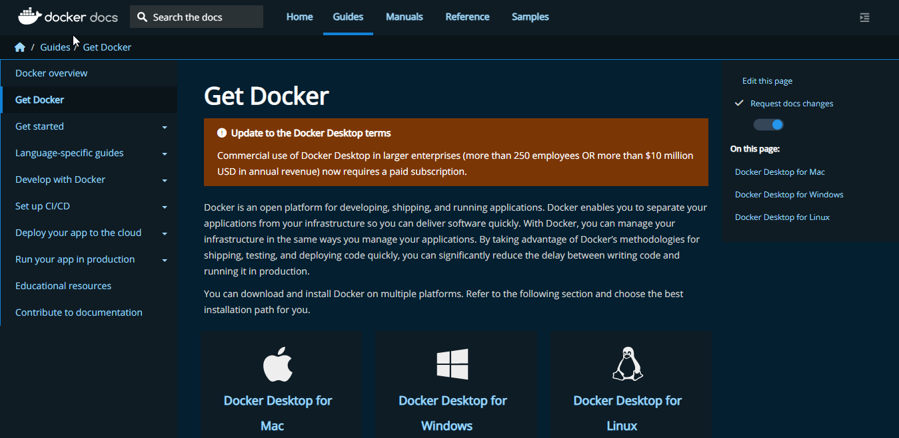

# Welcome to the Anythink Market repo

To start the app use Docker. It will start both frontend and backend, including all the relevant dependencies, and the db.

Please find more info about each part in the relevant Readme file ([frontend](frontend/readme.md) and [backend](backend/README.md)).

## Development

When implementing a new feature or fixing a bug, please create a new pull request against `main` from a feature/bug branch and add `@vanessa-cooper` as reviewer.

## First setup

Follow the steps to setup Anythink Market in your system :-

1. Clone the repo into your local 

    `git clone https://github.com/ObelusFamily/Anythink-Market-9xdxa.git`
2. [Install Docker](https://docs.docker.com/get-docker/) 🐋
    
    

 Download the appropriate software and install/setup docker in your machine


> To check whether docker have been installed in your system run,
```
docker -v 

docker-compose -v
```
3. Run Docker and wait till docker desktop starts


It should take a while , after it started it should look like this


4. Then, run 

``` 
docker-compose up 
````
from the project root directory to load Anythink's backend and frontend.


If Docker is working correctly, the backend should be running and able to connect to your local database. [Click Here To Test]( http://localhost:3000/api/ping)

> Initially it will take lot of time , as it is installing the necessary modules inorder to run the application. So wait patiently


5. If everything is working properly, you’ll be able to create a new user on 

[http://localhost:3001/register](http://localhost:3001/register)

Create a username and you are ready to go!!

Initial Setup is Complete

